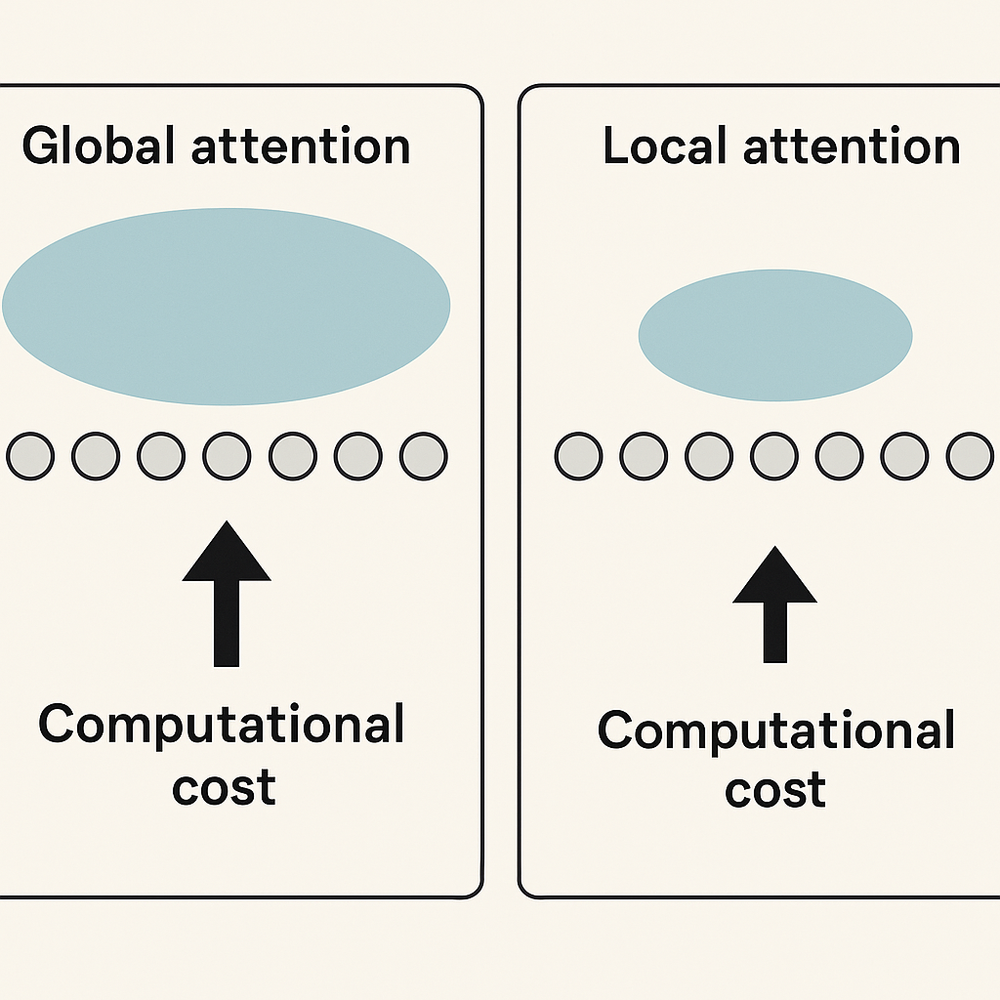
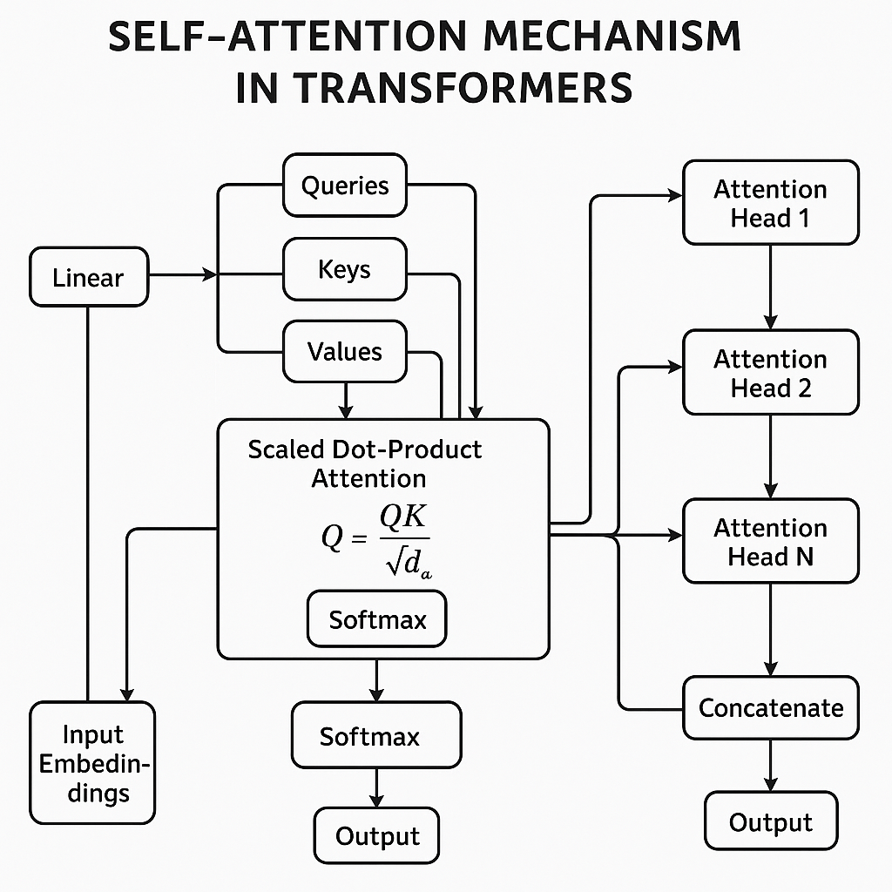
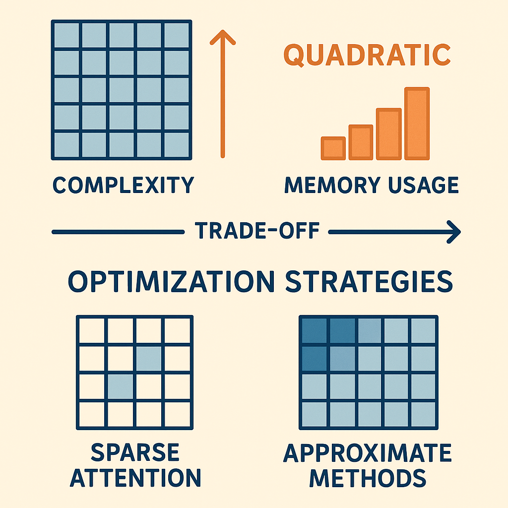

# Demystifying the Attention Mechanism in Transformers

## Introduction to Attention Mechanism
In neural networks, **attention** refers to a mechanism that enables models to dynamically focus on specific parts of the input data when generating outputs. Instead of treating all input elements equally, attention assigns varying levels of importance to different tokens or features, allowing the model to prioritize the most relevant information for a given task. This selective focus is crucial in handling complex data such as natural language, where context and relationships between words significantly affect meaning. Attention helps models overcome the limitations of earlier architectures like Recurrent Neural Networks (RNNs) and Convolutional Neural Networks (CNNs). RNNs process sequences step-by-step, which can cause difficulties in capturing long-range dependencies due to vanishing gradients and sequential bottlenecks. CNNs, while effective at local pattern recognition, struggle with modeling global context over sequences. Attention mechanisms address these issues by directly connecting all positions in the input sequence, enabling the model to consider relevant context regardless of distance. At a high level, attention can be categorized into **global** and **local** types. Global attention considers all elements in the input sequence when computing relevance scores, providing a comprehensive view but with higher computational cost. Local attention restricts focus to a subset of the sequence, reducing computation but potentially missing distant dependencies. Transformers primarily leverage global attention to achieve powerful sequence modeling.


*Comparison of global and local attention mechanisms in transformers.*

## Mechanics of Self-Attention in Transformers
At the core of transformer models lies the self-attention mechanism, which allows the model to weigh the importance of different parts of the input sequence dynamically. Understanding how self-attention works requires grasping the roles of queries, keys, and values, as well as the computation steps that produce the final attention output.

### Queries, Keys, and Values
Given an input sequence represented as embeddings, the transformer first projects these embeddings into three distinct vectors for each token: queries (Q), keys (K), and values (V). These projections are learned linear transformations: - **Queries (Q):** Represent the current token’s request to attend to other tokens. - **Keys (K):** Represent the tokens being attended to, acting as addresses in the sequence.

### Scaled Dot-Product Attention
The core of self-attention is the scaled dot-product attention formula: \[ \text{Attention}(Q, K, V) = \text{softmax}\left(\frac{QK^\top}{\sqrt{d_k}}\right) V

### Role of the Softmax Function
The softmax function transforms the scaled dot product scores into normalized attention weights. This normalization ensures all weights sum to 1, allowing the model to focus selectively on some tokens while ignoring others. Without softmax, the model could not interpret the raw dot products as meaningful probabilities, making the attention mechanism ineffective.

### Minimal Code Sketch
Below is a simplified PyTorch-style code snippet illustrating the calculation of attention scores and the output for a single attention head: ```python import torch

# Example input: batch_size=1, seq_len=3, embedding_dim=4
X = torch.tensor([[ [1.0, 0.0, 1.0, 0.0], [0.0, 2.0, 0.0, 2.0],

# Weight matrices for Q, K, V (embedding_dim -> d_k)
W_Q = torch.randn(4, 4) W_K = torch.randn(4, 4) W_V = torch.randn(4, 4)

### Multi-Head Attention
Instead of a single attention computation, transformers use multiple parallel attention heads. Each head has its own set of \( W^Q, W^K, W^V \) matrices and operates on a lower-dimensional subspace of the embeddings. The outputs of all heads are concatenated and linearly transformed to form the final output. Multi-head attention allows the model to capture different types of relationships and dependencies simultaneously. For example, one head might focus on short-range dependencies while another captures long-range context. This diversity improves the model’s capacity to understand complex patterns in the data.


*Flowchart illustrating the self-attention mechanism and multi-head attention in transformers.*

## Edge Cases and Failure Modes of Attention
While the attention mechanism is a powerful component of transformer models, it can encounter several challenges that affect model performance and interpretability. One common issue is **attention collapse**, where the attention distribution becomes overly concentrated on a single token or a small subset of tokens. This dominance can cause the model to ignore other relevant context, reducing the richness of the learned representation and potentially hurting downstream task performance. When dealing with **long sequences**, attention mechanisms face two main problems. First, the quadratic complexity of computing attention scores for every token pair can lead to significant computational bottlenecks. Second, as sequences grow longer, the attention weights may become diluted across many tokens, making it harder for the model to focus on truly important elements. This dilution can reduce the effectiveness of attention in capturing meaningful dependencies.

## Performance and Computational Considerations
The attention mechanism, particularly self-attention, is central to transformer models but comes with notable computational challenges. A primary factor is its quadratic complexity relative to the input sequence length. Specifically, for a sequence of length *n*, the self-attention operation computes pairwise interactions between all tokens, resulting in an *O(n²)* time and space complexity. This quadratic scaling means that doubling the sequence length roughly quadruples the computation and memory required, which quickly becomes prohibitive for long sequences. Memory consumption is another critical concern. Since the attention matrix stores attention weights for every token pair, it demands large amounts of memory during both training and inference. This limits the maximum sequence length that can be processed on typical hardware, especially when training large transformer models with many layers and attention heads. High memory usage can also slow down training due to increased data movement and limited batch sizes. To mitigate these issues, researchers have explored sparse and approximate attention methods. Sparse attention restricts the attention computation to a subset of token pairs, such as local neighborhoods or predefined patterns, reducing complexity to near-linear in some cases. Approximate methods use techniques like low-rank factorization or kernel-based approximations to estimate attention scores more efficiently. While these approaches significantly reduce computational costs and memory footprint, they often introduce trade-offs in accuracy. The approximations may miss some long-range dependencies captured by full attention, potentially impacting model performance on certain tasks.


*Diagram depicting computational challenges of attention and common optimization strategies like sparse and approximate attention.*

## Summary and Practical Implications
The attention mechanism is central to transformer models, enabling them to weigh the relevance of different input tokens dynamically. At its core, attention computes a weighted sum of value vectors, where weights are derived from the compatibility between query and key vectors. This allows transformers to capture long-range dependencies and contextual relationships more effectively than traditional sequence models. Understanding the failure modes of attention is crucial for building robust models. Common issues include attention dilution in very long sequences, where weights become too evenly spread, and sensitivity to input noise, which can mislead the attention distribution. Recognizing these pitfalls helps in designing strategies such as sparse attention, masking, or incorporating positional encodings more effectively. Performance considerations significantly impact transformer design. The quadratic complexity of standard attention with respect to sequence length motivates the use of optimized variants like Linformer, Performer, or memory-compressed attention. Balancing accuracy with computational cost often guides choices around model depth, attention head count, and sequence truncation.