<div align="center">

# 🧵 HitchAI

### An Agentic, AI-Powered Technical Blog Generation System

*Research → Plan → Parallel Write → Illustrate → Validate → Publish — fully autonomous, powered by LangGraph.*

[](https://www.python.org/)
[](https://www.langchain.com/langgraph)
[](https://www.langchain.com/)
[](https://streamlit.io/)
[](https://platform.openai.com/)
[](https://ai.google.dev/)
[](https://github.com/astral-sh/uv)
[](#-license)
[](#-contributing)

**[Overview](#-project-overview) · [Architecture](#-system-architecture) · [Installation](#-installation) · [Workflow](#-workflow-explanation) · [Agents](#-agent-reference) · [Roadmap](#-future-roadmap)**

</div>

---

## 📖 Table of Contents

- [Project Overview](#-project-overview)
- [Why HitchAI Exists](#-project-motivation)
- [Key Features](#-key-features)
- [Demo](#-demo)
- [System Architecture](#-system-architecture)
- [How It Works](#-how-it-works)
- [Agent Reference](#-agent-reference)
- [Research Pipeline](#-research-pipeline)
- [Planning Pipeline](#-planning-pipeline)
- [Worker Pipeline](#-worker-pipeline)
- [Reducer Pipeline](#-reducer-pipeline)
- [Image Generation Pipeline](#-image-generation-pipeline)
- [Markdown Validation](#-markdown-validation)
- [Streamlit Frontend](#-streamlit-frontend)
- [Project Structure](#-project-structure)
- [Installation](#-installation)
- [Environment Variables](#-environment-variables)
- [Running the Project](#-running-the-project)
- [Prompt Engineering Strategy](#-prompt-engineering-strategy)
- [Cost Optimization](#-cost-optimization)
- [Performance Optimizations](#-performance-optimizations)
- [Future Roadmap](#-future-roadmap)
- [FAQ](#-faq)
- [Contributing](#-contributing)
- [Acknowledgements](#-acknowledgements)
- [License](#-license)

---

## 🚀 Project Overview

**HitchAI** is an autonomous, multi-agent AI system that turns a single topic into a publication-ready technical blog post — complete with research-backed claims, structured sections, code snippets, tables, diagrams, and AI-generated images.

Give it a topic like:

```
"Attention Mechanism in Transformers"
```

...and HitchAI will:

1. 🧭 Decide whether the topic needs live research
2. 🔎 Collect and synthesize evidence from the web
3. 🗺️ Plan a complete blog outline (title, audience, tone, sections)
4. ⚡ Fan out section-writing to multiple **parallel workers**
5. 🧩 Reduce and merge all sections into one cohesive document
6. 🖼️ Decide where diagrams/images add value, then generate them
7. ✅ Validate and repair Markdown formatting
8. 📤 Serve the final blog through a polished Streamlit dashboard

Instead of a single prompt-and-pray LLM call, HitchAI simulates a **small editorial team** — a router, a researcher, a planner, several writers, an editor, an illustrator, and a proofreader — each with a narrow, well-defined responsibility. The result is more consistent, more factual, and dramatically more scalable than "write me a blog about X."

> [!NOTE]
> HitchAI is built entirely on **LangGraph**, using its `StateGraph`, conditional edges, and `Send`-based fan-out/fan-in primitives to model the editorial pipeline as a directed graph of typed state transitions.

---

## 💡 Project Motivation

Most "AI blog writers" are a single LLM call wrapped in a nice UI. That approach breaks down quickly:

- Long-form content generated in one shot tends to **drift**, repeat itself, and lose structure.
- A single model has to simultaneously **research, plan, write, and format** — a divided attention problem.
- There is no separation of concerns, so **debugging quality issues is nearly impossible**: was it a bad outline, bad research, or bad prose?
- Scaling section count means scaling prompt size linearly, which increases both **latency** and **hallucination risk**.

HitchAI's answer is to treat blog generation the way a real editorial team treats it: **decompose the job into independent, verifiable stages**, run the expensive part (writing) in parallel, and insert a validation stage before anything ships. This mirrors patterns popularized by agentic frameworks like LangGraph, CrewAI, and AutoGen — but purpose-built for long-form technical writing rather than generic task automation.

---

## ✨ Key Features

| Category | Capability |
|---|---|
| 🧠 **Adaptive Research** | Automatically classifies topics as `closed_book`, `hybrid`, or `open_book` and only spends research budget when freshness actually matters |
| 🔎 **Grounded Writing** | Every worker is given only the evidence it's allowed to cite — unsupported claims are explicitly disallowed |
| ⚡ **Parallel Section Generation** | 4–6 sections are generated concurrently via LangGraph's `Send` fan-out, cutting wall-clock time significantly |
| 🧩 **Deterministic Reduction** | A dedicated reducer subgraph merges, orders, and assembles the final document — no LLM is used just to "glue text together" |
| 🖼️ **Smart Image Planning** | A vision-aware planner decides *if, where, and why* an image should exist (max 3), instead of image-per-section spam |
| 🎨 **AI Diagram Generation** | GPT Image 1 renders architecture diagrams, comparisons, and conceptual illustrations, auto-inserted into Markdown |
| ✅ **Formatting-Only Validation** | Gemini 3.5 Flash repairs Markdown/LaTeX/table syntax **without rewriting a single sentence of content** |
| 🖥️ **Production Dashboard** | Streamlit UI with blog history, live progress, Markdown preview, image gallery, and one-click downloads |
| 💸 **Budget-Aware Planning** | The orchestrator is explicitly instructed to minimize LLM calls while preserving quality |
| 🧱 **Typed State Everywhere** | Pydantic models (`Plan`, `Task`, `EvidenceItem`, `RouterDecision`, `GlobalImagePlan`) enforce structure end-to-end |

---

## 🎬 Demo

> [!TIP]
> Add a GIF or screen recording here showing a topic being entered and the final blog being generated end-to-end.

```
📸 demo/hitchai-demo.gif   <-- placeholder
```

### Screenshots

| Generation View | Blog Preview | Image Gallery |
|---|---|---|
| `screenshots/generate.png` | `screenshots/preview.png` | `screenshots/gallery.png` |

---

## 🏗️ System Architecture

HitchAI is composed of a **main orchestration graph** and a **reducer subgraph**. The main graph handles routing, research, planning, and parallel writing. The reducer subgraph takes over once all sections exist, handling merging, illustration, and validation.

### 1. Overall Architecture

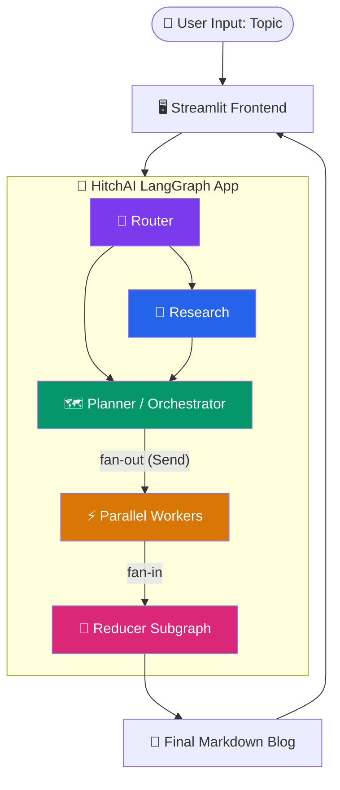

### 2. LangGraph Workflow (Main Graph)

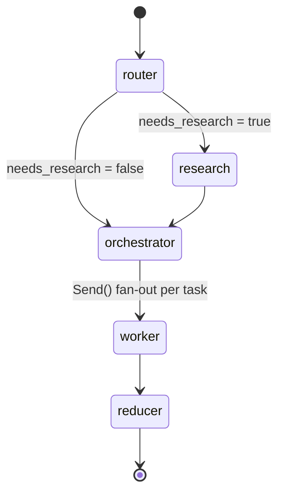

### 3. Sequence Diagram — Single Blog Generation Request

```mermaid
sequenceDiagram
    actor U as User
    participant FE as Streamlit UI
    participant R as Router
    participant RS as Research
    participant O as Orchestrator (Planner)
    participant W as Workers (parallel)
    participant RD as Reducer

    U->>FE: Enter topic
    FE->>R: run(topic)
    R->>R: Classify mode (closed/hybrid/open)
    alt needs_research == true
        R->>RS: queries
        RS->>RS: Web search + evidence synthesis
        RS->>O: EvidencePack
    else needs_research == false
        R->>O: skip research
    end
    O->>O: Generate Plan (sections, tasks)
    O->>W: Send() one task per section (parallel)
    par Section 1
        W->>W: Generate section 1 markdown
    and Section 2
        W->>W: Generate section 2 markdown
    and Section N
        W->>W: Generate section N markdown
    end
    W->>RD: sections[] (fan-in)
    RD->>RD: merge_content
    RD->>RD: decide_images
    RD->>RD: generate_and_place_images
    RD->>RD: markdown_validator
    RD->>FE: final markdown
    FE->>U: Rendered blog + images
```

### 4. Agent Collaboration Diagram

```mermaid
flowchart LR
    subgraph Editorial["📰 HitchAI Editorial Team"]
        direction LR
        A1["🧭 Router<br/>decides research need"]
        A2["🔎 Evidence Collector<br/>gathers & synthesizes sources"]
        A3["🗺️ Planner<br/>outlines the blog"]
        A4["✍️ Worker Pool<br/>writes sections in parallel"]
        A5["🧩 Reducer<br/>merges sections"]
        A6["🖼️ Image Planner<br/>decides visual needs"]
        A7["🎨 Image Generator<br/>renders diagrams"]
        A8["✅ Markdown Validator<br/>fixes formatting only"]
    end

    A1 --> A2 --> A3 --> A4 --> A5 --> A6 --> A7 --> A8

    style A1 fill:#7C3AED,color:#fff
    style A2 fill:#2563EB,color:#fff
    style A3 fill:#059669,color:#fff
    style A4 fill:#D97706,color:#fff
    style A5 fill:#DB2777,color:#fff
    style A6 fill:#0891B2,color:#fff
    style A7 fill:#CA8A04,color:#fff
    style A8 fill:#DC2626,color:#fff
```

### 5. Research Pipeline

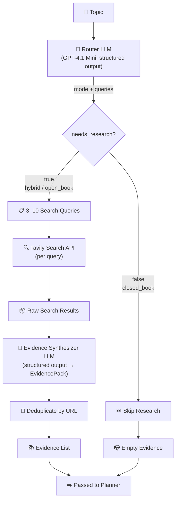

### 6. Reducer Pipeline

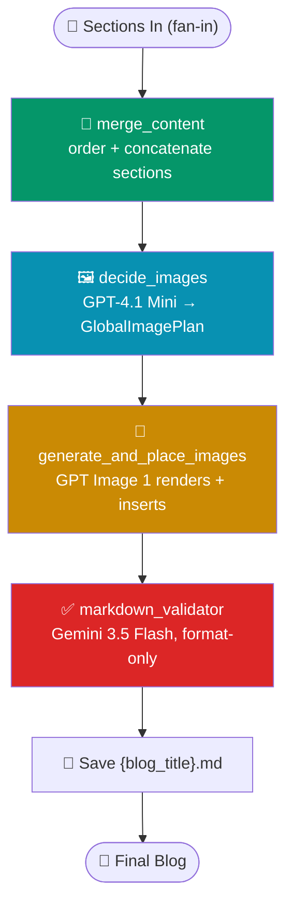

### 7. Image Generation Pipeline

```mermaid
flowchart LR
    MD["📄 Merged Markdown"] --> Extract["📑 Extract Headings +<br/>First 3 Lines per Section"]
    Extract --> Compact["🗜️ Compact Article Summary"]
    Compact --> Planner["🧠 Image Planner LLM<br/>(GPT-4.1 Mini)"]
    Planner --> Plan["📋 GlobalImagePlan<br/>≤ 3 image specs"]
    Plan --> Loop{"For each<br/>image spec"}
    Loop --> Prompt["✍️ prompt + alt + caption + placeholder"]
    Prompt --> ImageGen["🎨 GPT Image 1<br/>images.generate()"]
    ImageGen --> Save2["💾 Save to /images/*.png"]
    Save2 --> Replace["🔁 Replace [[IMAGE_N]]<br/>with Markdown image + caption"]
    Replace --> Final2["📄 Markdown with Images"]
```

### 8. Project Folder Tree

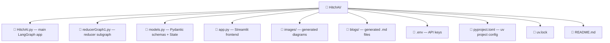

### 9. Frontend Workflow

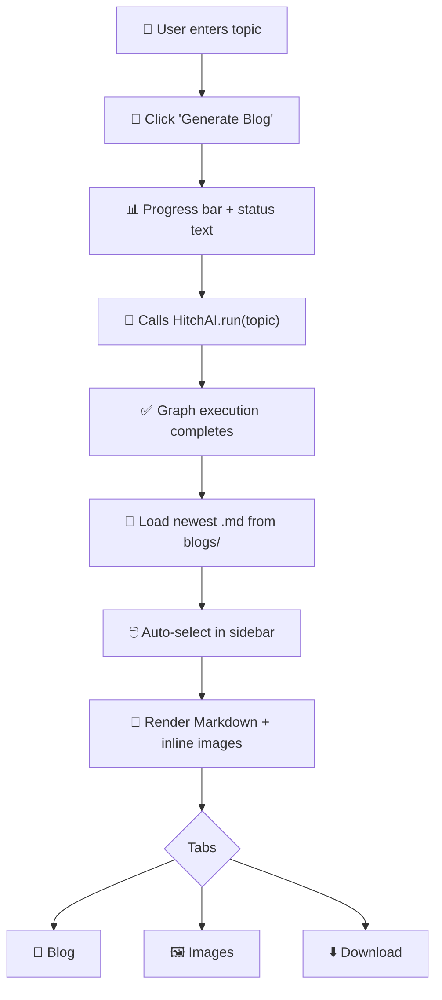

### 10. State Flow (Typed `State` object across the graph)

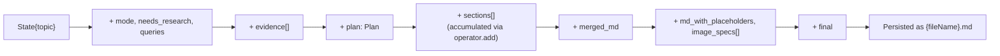

---

## ⚙️ How It Works

HitchAI executes as a single LangGraph application (`app = globe.compile()`), invoked once per topic via `run(topic)`. The pipeline is best understood in two halves:

### Phase 1 — Plan (Router → Research → Orchestrator → Fan-out)

1. **Router** classifies the topic into `closed_book`, `hybrid`, or `open_book` and produces up to 10 targeted search queries.
2. **Research** (conditionally skipped) runs each query through Tavily Search, then asks an LLM to synthesize the raw results into a clean, deduplicated `EvidencePack`.
3. **Orchestrator** consumes the topic, mode, and evidence to produce a `Plan` — 4 to 6 sections, each with a goal, 3–6 actionable bullets, a target word count, and flags like `requires_code`, `requires_research`, and `requires_citations`.
4. **Fan-out** converts each `Task` in the plan into a `Send("worker", payload)` call, launching all sections **concurrently**.

### Phase 2 — Produce (Workers → Reducer subgraph)

5. **Workers** each receive exactly one section's task, the shared plan metadata, and only the evidence they're allowed to cite. Each worker returns Markdown for its section alone.
6. **Reducer subgraph** takes over once all workers finish (LangGraph's built-in fan-in via the `sections` reducer using `operator.add`):
   - `merge_content` orders sections by task ID and concatenates them under the blog title.
   - `decide_images` builds a compact section-by-section summary and asks an image-planning LLM where (if anywhere) images belong.
   - `generate_and_place_images` calls GPT Image 1 for each planned image and swaps placeholders for real Markdown image tags.
   - `markdown_validator` sends the final draft to Gemini 3.5 Flash with strict instructions to fix *only* formatting — never content — and persists the result to disk.

The Streamlit frontend simply calls `run(topic)`, waits for the graph to finish, and loads the newest `.md` file from disk.

---

## 🧠 Agent Reference

| Agent | Purpose | Input | Output | LLM Used |
|---|---|---|---|---|
| 🧭 **Router** | Decide if research is needed and generate search queries | Topic | `RouterDecision` (mode, needs_research, queries) | GPT-4.1 Mini |
| 🔎 **Evidence Collector** | Turn raw search results into clean, citable evidence | Raw Tavily results | `EvidencePack` (deduplicated `EvidenceItem[]`) | GPT-4.1 Mini |
| 🗺️ **Planner / Orchestrator** | Design the blog outline and per-section tasks | Topic, mode, evidence | `Plan` (title, audience, tone, tasks) | GPT-4.1 Mini |
| ⚡ **Worker (×N)** | Write exactly one section in Markdown | Task, plan, evidence | Section Markdown | GPT-4.1 Mini |
| 🧩 **Reducer** | Merge all sections into one document | `sections[]` | `merged_md` | *(deterministic, no LLM)* |
| 🖼️ **Image Planner** | Decide where images add value | Section summaries | `GlobalImagePlan` (≤3 image specs) | GPT-4.1 Mini |
| 🎨 **Image Generator** | Render diagrams/illustrations | Image prompt | PNG file + Markdown image tag | GPT Image 1 |
| ✅ **Markdown Validator** | Repair formatting without altering content | Final draft | Cleaned Markdown | Gemini 3.5 Flash |

> [!TIP]
> Notice that the **Reducer's merge step uses no LLM at all** — ordering and concatenating sections is a deterministic operation. Spending a model call on "glue the text together" would be pure waste.

---

## 🔎 Research Pipeline

Not every topic needs fresh web research. "Attention Mechanism in Transformers" is evergreen; "Best LLM releases this week" is not. HitchAI's router makes this call explicitly, upfront, instead of letting every downstream agent guess:

- **`closed_book`** — evergreen fundamentals; no research is triggered.
- **`hybrid`** — mostly evergreen but benefits from current examples, tools, or models.
- **`open_book`** — inherently time-sensitive (roundups, rankings, pricing, policy); research is mandatory and every section becomes claim-summary-style rather than tutorial-style.

When research is triggered, each query hits the **Tavily Search API** independently, and all raw results are pooled and passed to a synthesis LLM that:

- Keeps only results with a valid URL
- Prefers authoritative sources (official docs, company blogs, reputable outlets)
- Preserves publish dates only when explicitly present — never guesses them
- Deduplicates by URL before handing evidence to the planner

This evidence is the **only material** workers are allowed to cite for time-sensitive claims — a hard constraint enforced in the worker prompt itself.

---

## 🗺️ Planning Pipeline

The orchestrator is the single most consequential agent in HitchAI: a mediocre outline guarantees a mediocre blog, no matter how good the writers are downstream.

The planner is instructed to:

- Produce **4–6 sections only** — never a sprawling 15-section outline that balloons cost
- Give every section a one-sentence **goal** and 3–6 **concrete, non-overlapping bullets**
- Assign a **target word count** (120–550 words per section)
- Ensure the overall plan includes at least two of: code sketch, edge cases, performance/cost notes, security notes, or debugging tips
- Explicitly minimize the number of downstream LLM calls (i.e., resist the temptation to over-fragment sections), since **every task = one additional worker call**

The output strictly matches the `Plan` Pydantic schema, so downstream nodes never have to defensively parse free text.

---

## ✍️ Worker Pipeline

Each worker is a stateless function invoked once per section via LangGraph's `Send` API. A worker receives:

- Its **single** `Task` (goal, bullets, target word count, flags)
- The shared `Plan` (title, audience, tone, blog kind, constraints)
- The topic and research mode
- Only the evidence relevant to grounded, citable claims

Workers are bound by strict rules:

- Cover every bullet, in order — no skipping, no merging
- Stay within ±15% of the target word count
- Output **only** the section body in Markdown, starting with a `##` heading — no blog title, no commentary
- For `open_book` mode, never drift into a how-to/tutorial unless bullets explicitly ask for it
- Attach a Markdown source link for every claim that requires citation; if unsupported, explicitly write *"Not found in provided sources"* rather than fabricating one
- Follow strict LaTeX rules (`$...$` inline, `$$...$$` block, never `\[...\]`) and always close code fences

Because each worker only ever sees its own section, generation is **embarrassingly parallel** — LangGraph dispatches all `Send("worker", ...)` calls concurrently and waits for every one to resolve before continuing.

---

## 🧩 Reducer Pipeline

The reducer is a **subgraph**, not a single node — this is a deliberate architectural choice. Four independent responsibilities live here, each easy to reason about, test, and swap out in isolation:

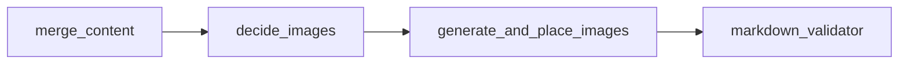

1. **`merge_content`** — sorts sections by task ID and concatenates them beneath an H1 title. No LLM involved; this is pure, deterministic string assembly.
2. **`decide_images`** — compresses the merged Markdown into a lightweight, heading + first-3-lines summary per section, then asks an LLM to return a `GlobalImagePlan`: at most 3 image specs, each with a prompt, alt text, caption, and a unique placeholder token (`[[IMAGE_1]]`, etc.).
3. **`generate_and_place_images`** — for each image spec, calls GPT Image 1, writes the PNG to `/images`, and replaces its placeholder with a proper Markdown image tag and caption. Failures degrade gracefully into a visible blockquote instead of crashing the pipeline.
4. **`markdown_validator`** — the final gate before persistence. Sends the draft to Gemini 3.5 Flash with an explicit **format-only** contract, then writes the validated (or, on failure, original) Markdown to `{blog_title}.md`.

> [!WARNING]
> `generate_and_place_images` and `markdown_validator` both include fallback paths (failed image → warning blockquote; failed validation → original draft). This means a single flaky API call never crashes the whole pipeline — it degrades the output slightly instead of losing it entirely.

---

## 🖼️ Image Generation Pipeline

Images are treated as a **scarce, deliberate resource**, not a decorative default. The image planner is capped at **3 images maximum** and instructed to prefer only genuinely useful visuals: architecture diagrams, flowcharts, comparison tables, timelines, and conceptual illustrations — never filler.

Why separate image *planning* from image *generation*?

- **Planning is cheap, generation is expensive.** GPT Image 1 calls cost meaningfully more than a text completion. Deciding "should an image exist here, and why" with a fast reasoning pass avoids wasting an image generation call on a section that doesn't need one.
- **Placement quality improves.** A planner that sees the *whole* article can choose the 1–3 most valuable illustration points, rather than each worker independently deciding "my section needs a picture" and producing redundant or poorly distributed visuals.
- **Failure isolation.** If image generation fails, only the image step degrades (visible warning in the Markdown) — the text content, already validated, is unaffected.

---

## ✅ Markdown Validation

The validator's contract is intentionally narrow: **fix formatting, touch nothing else.** It is explicitly forbidden from rewriting content, summarizing, adding information, removing technical detail, or altering explanations.

It exists because LLM-generated Markdown — especially when assembled from multiple independently generated sections — commonly accumulates small but breaking issues:

- Unclosed code fences
- Inconsistent heading levels between sections written by different worker calls
- Malformed tables
- Raw `\[ ... \]` LaTeX instead of `$$ ... $$`
- Stray whitespace and broken links/images

Rather than trusting every worker to be perfectly consistent, HitchAI runs one **final, cheap, deterministic-in-intent** pass with Gemini 3.5 Flash at `temperature=0`, whose only job is syntactic hygiene. This separation means content quality (creative, higher-temperature) and formatting correctness (mechanical, zero-temperature) are optimized independently instead of being in tension inside a single prompt.

---

## 🖥️ Streamlit Frontend

The frontend is a lightweight, file-system-backed dashboard — no external database required.

**Sidebar**
- 📚 Searchable list of previously generated blogs (sorted by most recent)
- 🔄 Manual refresh
- Automatically excludes `README` from the blog list

**Main View**
- 📝 Topic input + **Generate Blog** button with a live progress bar and status messages
- 📊 Metrics: word count, estimated reading time, image count
- Three tabs:
  - **📖 Blog** — rendered Markdown with inline images
  - **🖼 Images** — gallery of all images referenced in the blog
  - **⬇ Download** — one-click Markdown download

Custom CSS gives buttons rounded corners and consistent height, and blog cards a clean bordered look, keeping the UI visually consistent with modern AI tooling dashboards.

---

## 📁 Project Structure

```
HitchAI/
├── HitchAI.py              # Main LangGraph app: router, research, orchestrator, worker, fan-out
├── reducerGraph1.py         # Reducer subgraph: merge, image planning/generation, validation
├── models.py                 # Pydantic schemas (State, Plan, Task, EvidenceItem, EvidencePack,
│                              #   RouterDecision, GlobalImagePlan) — the typed contract of the graph
├── app.py                    # Streamlit frontend (blog history, generation, preview, download)
├── images/                   # Generated diagrams/illustrations (PNG), created at runtime
├── *.md                      # Generated blog posts, saved as {blog_title}.md
├── .env                      # OPENAI_API_KEY, GOOGLE_API_KEY, TAVILY_API_KEY, etc.
├── pyproject.toml            # uv-managed project & dependency definition
├── uv.lock                   # uv lockfile for reproducible installs
└── README.md                 # You are here
```

### File Responsibilities

| File | Responsibility |
|---|---|
| `HitchAI.py` | Defines `State`-driven graph nodes for routing, research, planning, and parallel section writing; compiles and exposes `run(topic)` |
| `reducerGraph1.py` | Defines the reducer subgraph: deterministic merge, LLM-driven image planning, image generation via GPT Image 1, and format-only validation via Gemini |
| `models.py` | Single source of truth for all typed state and structured LLM outputs used across every node |
| `app.py` | Presents the system to end users: triggers `run()`, lists history, renders Markdown + images, offers downloads |

---

## 🛠️ Installation

HitchAI uses **[uv](https://github.com/astral-sh/uv)** as its Python package and environment manager for fast, reproducible installs.

### Prerequisites

- Python 3.11+
- [uv](https://docs.astral.sh/uv/getting-started/installation/) installed globally
- API keys for OpenAI, Google (Gemini), and Tavily

### Setup

```bash
# 1. Clone the repository
git clone https://github.com/<your-org>/HitchAI.git
cd HitchAI

# 2. Create and sync the environment with uv
uv sync

# 3. Copy the example environment file
cp .env.example .env
# then fill in your API keys (see below)
```

---

## 🔑 Environment Variables

Create a `.env` file in the project root:

```env
# Required — powers Router, Research synthesis, Orchestrator, and Workers
OPENAI_API_KEY=sk-...

# Required — powers GPT Image 1 diagram generation
# (uses the same OPENAI_API_KEY above via the OpenAI client)

# Required — powers the Markdown Validator (Gemini 3.5 Flash)
GOOGLE_API_KEY=...

# Required — powers the Research node's web search
TAVILY_API_KEY=tvly-...
```

| Variable | Used By | Required |
|---|---|---|
| `OPENAI_API_KEY` | Router, Research synthesis, Orchestrator, Workers, Image Generator | ✅ |
| `GOOGLE_API_KEY` | Markdown Validator (Gemini 3.5 Flash) | ✅ |
| `TAVILY_API_KEY` | Research node (web search) | ✅ |

---

## ▶️ Running the Project

### Run the pipeline directly (CLI / script)

```bash
uv run python HitchAI.py
```

By default this executes:

```python
if __name__ == "__main__":
    run("Attention mechanism in transformers")
```

### Run the Streamlit dashboard

```bash
uv run streamlit run app.py
```

Then open the printed local URL (typically `http://localhost:8501`), enter a topic, and click **🚀 Generate Blog**.

---

## 🧪 Prompt Engineering Strategy

Every agent in HitchAI has a **narrow, single-purpose system prompt** rather than one giant "do everything" instruction. This is deliberate:

- **Router prompt** defines mode boundaries with concrete examples (evergreen vs. "this week/latest") so classification is consistent across runs.
- **Research synthesis prompt** enforces strict evidence hygiene: no URL, no entry; no guessed dates; deduplicate by URL.
- **Orchestrator prompt** encodes a hard section-count ceiling and an explicit **LLM-budget awareness** instruction — the model is told that every task equals one more paid call, and to plan accordingly.
- **Worker prompt** separates *content rules* (cover every bullet, respect word count, ground claims in evidence) from *formatting rules* (heading syntax, LaTeX delimiters, closed code fences) so both are enforced without competing for the model's attention.
- **Image planner prompt** is explicitly told to avoid decorative images and cap output at 3, preventing image sprawl.
- **Validator prompt** is scoped to formatting only, with an explicit "DO NOT" list (no rewriting, no summarizing, no new information) so it can run at `temperature=0` without degrading the writing quality produced earlier at higher temperature.

All structured outputs (`RouterDecision`, `EvidencePack`, `Plan`, `GlobalImagePlan`) are enforced via `llm.with_structured_output(...)`, removing an entire class of prompt-injection and malformed-output failure modes that string-parsing approaches suffer from.

---

## 💸 Cost Optimization

HitchAI is designed under an explicit **LLM-call budget mindset**, not just a quality mindset:

- The **router** skips research entirely for evergreen topics, avoiding unnecessary search + synthesis calls.
- The **orchestrator** is instructed to produce the *minimum* number of sections needed for a complete blog (4–6), directly capping the number of downstream worker calls, since each task equals one worker invocation.
- The **reducer's merge step uses zero LLM calls** — it's pure Python string assembly.
- The **image planner** caps generation at 3 images and screens out decorative requests, avoiding wasted GPT Image 1 calls (the most expensive step per-unit in the pipeline).
- The **validator** runs once, at the very end, at `temperature=0`, rather than validating after every intermediate step.
- **Deduplication by URL** in the research stage avoids redundant evidence bloating downstream prompt sizes (and therefore token cost) for every worker.

---

## ⚡ Performance Optimizations

- **Parallel section generation** via LangGraph's `Send` API means wall-clock time for the writing phase is roughly bounded by the *slowest single section*, not the sum of all sections.
- **Compact image-planning context** — `build_image_context` reduces the entire merged blog down to headings + first 3 lines per section before it ever reaches the image-planning LLM, keeping that call fast and cheap.
- **Conditional research** avoids the multi-query search + synthesis roundtrip entirely for `closed_book` topics.
- **Structured outputs** eliminate slow, error-prone regex/JSON-repair loops that unstructured text generation would otherwise require.
- **Graceful degradation** on image or validation failures means the pipeline never stalls waiting on a retry loop — it logs, falls back, and keeps moving.

---

## 🗺️ Future Roadmap

- [ ] Multi-provider model routing (swap OpenAI/Gemini per node via config)
- [ ] Per-section revision loop (critique agent that can request a worker rewrite)
- [ ] SEO metadata generation (title tags, meta description, slug)
- [ ] Pluggable image backends (DALL·E, Imagen, local diffusion models)
- [ ] Vector-store-backed long-term memory for recurring topics/series
- [ ] Automatic internal linking between previously generated blogs
- [ ] Export to additional formats (MDX, Notion, Ghost, Dev.to API)
- [ ] Human-in-the-loop approval step between planning and writing
- [ ] Streaming section generation into the Streamlit UI in real time
- [ ] Configurable section count and tone presets per blog "kind"

---

## ❓ FAQ

<details>
<summary><strong>Why use multiple agents instead of one large prompt?</strong></summary>

A single LLM call has to simultaneously research, plan, write, and format long-form content — competing objectives that degrade each other. Splitting responsibilities lets each agent specialize, makes failures easier to isolate and debug, and enables true parallelism during the most expensive step (writing).
</details>

<details>
<summary><strong>Why does the Reducer exist as a separate subgraph?</strong></summary>

Merging, image planning, image generation, and validation are four distinct concerns with different failure modes and different costs. Isolating them as a subgraph keeps each step testable independently and allows the fan-in from parallel workers to be handled cleanly by LangGraph before any post-processing begins.
</details>

<details>
<summary><strong>Why is the Markdown Validator kept separate from the Workers?</strong></summary>

Workers write at a higher temperature to maximize content quality and voice; formatting correctness is a deterministic, mechanical concern best handled at `temperature=0` by a dedicated pass. Combining the two would force a tradeoff between creative writing quality and syntactic precision inside one prompt.
</details>

<details>
<summary><strong>Why is Image Planning separated from Image Generation?</strong></summary>

Image generation (GPT Image 1) is the most expensive per-call step in the pipeline. A cheap planning pass first decides *whether an image is even worth generating*, preventing wasted spend on decorative or redundant visuals and improving where the (at most 3) images actually appear.
</details>

<details>
<summary><strong>Does HitchAI hallucinate facts?</strong></summary>

Workers are explicitly restricted to citing only URLs present in the evidence they're given, and instructed to write "Not found in provided sources" rather than fabricate a citation. Evergreen, non-factual reasoning is allowed without citation; anything requiring freshness is grounded.
</details>

<details>
<summary><strong>Can I run this without research (Tavily)?</strong></summary>

Yes — for `closed_book` topics the router skips research entirely. You still need a valid `TAVILY_API_KEY` configured for topics that route to `hybrid`/`open_book` mode, since the graph will attempt to call it.
</details>

<details>
<summary><strong>How is scalability handled if I want more sections or workers?</strong></summary>

Because sections are dispatched via LangGraph's `Send` fan-out, increasing the number of tasks in the `Plan` automatically scales the number of parallel worker invocations — no code changes are required, only the orchestrator's own section-count ceiling.
</details>

---

## 🤝 Contributing

Contributions are welcome! To propose a change:

1. Fork the repository
2. Create a feature branch: `git checkout -b feature/my-feature`
3. Make your changes and add/update tests where relevant
4. Run `uv sync` to ensure your environment matches the lockfile
5. Open a Pull Request with a clear description of the change and motivation

> [!TIP]
> For larger architectural changes (new agents, new subgraphs), please open an issue first to discuss the design before submitting a PR.

---

## 🙏 Acknowledgements

- [LangGraph](https://www.langchain.com/langgraph) — the orchestration engine powering HitchAI's entire agentic workflow
- [LangChain](https://www.langchain.com/) — LLM integration layer and structured output tooling
- [OpenAI](https://platform.openai.com/) — GPT-4.1 Mini (reasoning/writing) and GPT Image 1 (illustration)
- [Google Gemini](https://ai.google.dev/) — Gemini 3.5 Flash for formatting validation
- [Tavily](https://tavily.com/) — web search API powering the research pipeline
- [Streamlit](https://streamlit.io/) — the dashboard framework behind the frontend
- [uv](https://github.com/astral-sh/uv) — fast, modern Python package management

---

## 📄 License

This project is licensed under the **MIT License** — see the [LICENSE](./LICENSE) file for details.

---

<div align="center">

Built with 🧠 multi-agent orchestration, ⚡ parallel execution, and a healthy respect for Markdown syntax.

**HitchAI** — hitch a ride from idea to published technical blog.

</div>