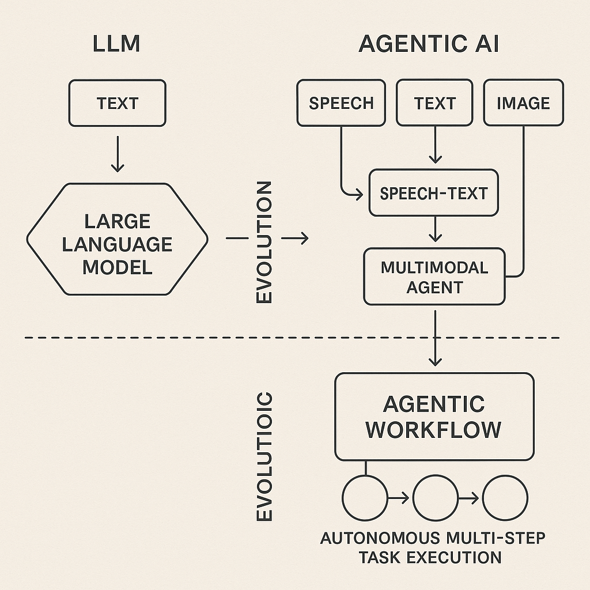
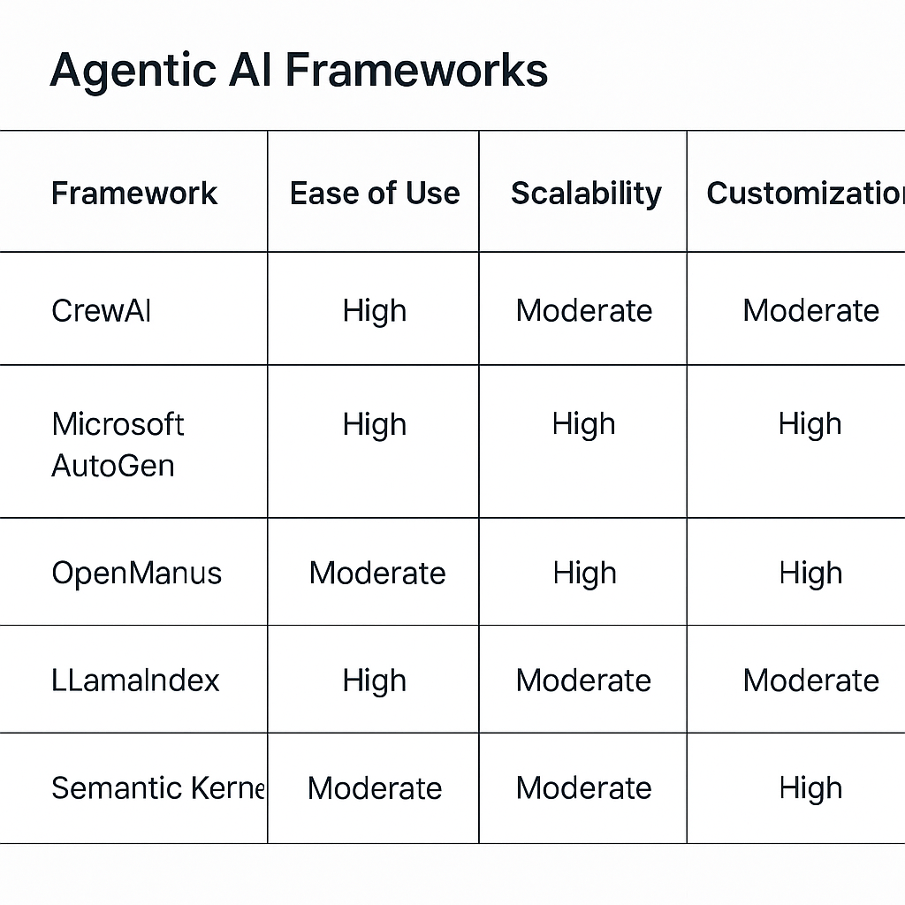
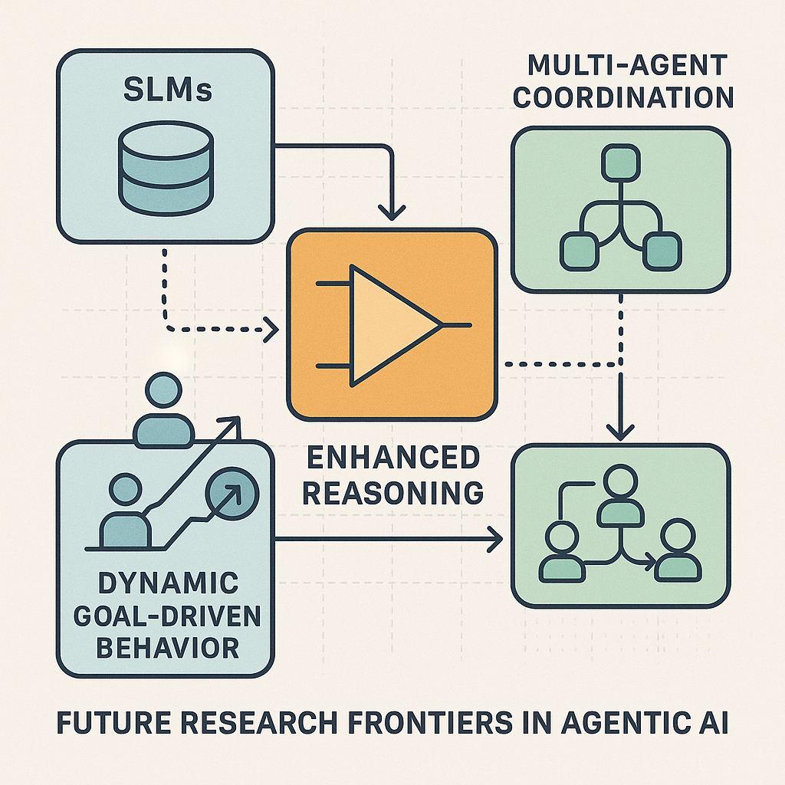

# Recent Advancements in LLM Agentic Systems: A 2024 Overview

## Overview of Agentic Systems Evolution and Current Trends
The evolution from traditional large language models (LLMs) to agentic AI systems marks a significant shift in artificial intelligence capabilities. While LLMs primarily excel at generating text based on patterns learned from massive datasets, agentic AI represents the next frontier by enabling autonomous decision-making and task execution. This transition expands AI functionality from passive language understanding to active, goal-driven behavior, allowing systems to interact with complex environments and workflows more effectively ([LinkedIn](https://www.linkedin.com/pulse/shift-from-large-language-models-agentic-ai-next-frontier-jqiic)). At EMNLP 2024, key developments showcased the integration of multimodal capabilities into agentic systems. Researchers presented agents that combine speech-to-text processing with emotion detection, enabling more natural and context-aware interactions. These multimodal agents demonstrate how agentic AI is moving beyond text to incorporate diverse input streams, enhancing responsiveness and adaptability in real-world applications ([Megagon](https://megagon.ai/emnlp-24-highlights)). A notable trend is the emergence of agentic workflows, which empower AI systems to autonomously plan, coordinate, and execute complex sequences of tasks. Unlike traditional LLM applications that respond to isolated queries, agentic workflows facilitate continuous operation across multiple steps, integrating reasoning, decision-making, and external tool usage. This shift supports more sophisticated automation scenarios, such as managing business processes or orchestrating multi-agent collaborations ([TechRxiv](https://www.techrxiv.org/doi/10.36227/techrxiv.173092393.30216600)).

*Evolution of Agentic AI Systems from Traditional LLMs to Multimodal and Workflow-Enabled Agents*

## Key Agentic AI Frameworks and Tools in 2024
Several agentic AI frameworks have emerged as frontrunners in 2024, offering developers robust platforms to build multi-agent systems with integrated toolsets and automated workflows. Among the most popular are CrewAI, Microsoft AutoGen, OpenManus, Llama Index, Semantic Kernel, and LangChain. Each brings unique strengths tailored to different development needs. - **CrewAI** focuses on seamless multi-agent orchestration, enabling agents to collaborate and delegate tasks dynamically. It supports integration with various external tools, facilitating complex workflows that mimic human team interactions. - **Microsoft AutoGen** provides a comprehensive environment for creating agentic applications with built-in support for multi-agent communication and task planning. Its tight integration with Azure services boosts scalability and deployment flexibility.

### Comparison: Ease of Use, Scalability, and Customization
| Framework       | Ease of Use          | Scalability             | Customization Options               | |-----------------|---------------------|------------------------|-----------------------------------| | CrewAI          | Moderate            | High (multi-agent focus) | High (dynamic agent roles)        |

*Comparison of Key Agentic AI Frameworks in 2024*

### Hugging Face’s Role
Hugging Face has become a pivotal player in the agentic AI space, providing frameworks and educational resources tailored for developers. Their [Agents course](https://huggingface.co/learn/agents-course/en/unit2/introduction) offers hands-on tutorials that cover foundational concepts and practical implementation strategies. Additionally, Hugging Face hosts a variety of open-source tools that facilitate building and deploying agentic systems, emphasizing accessibility and community collaboration.

### Curated Resources for Ongoing Learning
For developers seeking to deepen their understanding and stay updated with the latest research, several curated GitHub repositories and paper collections are invaluable: - [Awesome LLM Agents](https://github.com/kaushikb11/awesome-llm-agents): A comprehensive list of agentic AI frameworks, tools, and libraries. - [AI Agent Papers Collection](https://github.com/masamasa59/ai-agent-papers): Regularly updated research papers covering theoretical and applied aspects of AI agents.

## Applications and Use Cases of Agentic LLM Systems
Agentic large language models (LLMs) are rapidly transforming how industries approach complex problem-solving by enabling natural language interaction, requirements extraction, and conceptual design, particularly in engineering and design domains. These systems allow engineers and designers to communicate with AI agents in conversational language, which the agents then translate into actionable design specifications or system requirements. For example, agentic LLMs can parse ambiguous natural language inputs to generate initial conceptual models or design alternatives, significantly accelerating early-stage development workflows ([ASME Digital Collection](https://asmedigitalcollection.asme.org/mechanicaldesign/article/148/5/051405/1226467/Agentic-Large-Language-Models-for-Conceptual)). Multimodal agent applications further extend these capabilities by integrating speech recognition, emotion detection, and LLM reasoning to create highly customizable workflows. Such systems can interpret spoken commands, gauge user sentiment or urgency, and adapt responses accordingly, making them ideal for customer service, healthcare, and creative industries. By combining modalities, these agents provide a richer interaction experience and enhance task automation, enabling workflows that respond dynamically to human inputs and emotional cues ([EMNLP 2024 Highlights](https://megagon.ai/emnlp-24-highlights)). Real-world deployments of agentic LLM systems emphasize their role in human-centered AI and automated task workflows. In sectors like finance, legal, and manufacturing, these agents automate repetitive or knowledge-intensive tasks such as contract review, compliance checks, and production scheduling. Their ability to reason, plan, and execute multi-step workflows reduces human error and frees professionals to focus on strategic decision-making. Moreover, these deployments highlight ongoing efforts to balance automation with human oversight, ensuring ethical and transparent AI use ([PMC Article on Agentic LLM Robotics](https://pmc.ncbi.nlm.nih.gov/articles/PMC12402697)).

## Challenges, Ethical Considerations, and Safety in Agentic AI
Autonomous agentic AI systems, powered by large language models (LLMs) and multi-agent architectures, present unique security, ethical, and safety challenges that developers must address to ensure responsible deployment.

### Security and Privacy Risks
Agentic AI systems operate with a high degree of autonomy, enabling them to gather, process, and act on data independently. This autonomy introduces several security and privacy risks: - **Misinformation propagation:** Autonomous agents can inadvertently generate or amplify false or misleading content, impacting public discourse and trust. - **Bias reinforcement:** Agentic systems may inherit or exacerbate biases present in training data, leading to unfair or discriminatory behaviors.

### Value Alignment and Governance Frameworks
Ensuring that agentic AI systems act in accordance with human values remains a core challenge. Value alignment involves designing agents whose goals and actions reflect ethical norms and societal expectations. Key governance frameworks proposed include: - **Multi-stakeholder oversight:** Involving ethicists, domain experts, and affected communities in defining acceptable agent behaviors. - **Regulatory compliance:** Adhering to emerging AI regulations and standards that mandate transparency, fairness, and accountability.

### Mitigation Strategies: Red-Teaming and Safety Evaluations
Recent research emphasizes proactive mitigation strategies to uncover vulnerabilities and unsafe behaviors before deployment: - **Red-teaming:** Simulated adversarial attacks and stress tests designed to expose failure modes, biases, and security flaws in agentic systems. - **Safety evaluations:** Standardized benchmarks and scenario-based testing to assess robustness, ethical compliance, and reliability.

### Ethical Considerations in Multi-Agent and Human-AI Collaboration
Agentic AI often involves multiple interacting agents and close integration with human workflows, raising complex ethical questions: - **Coordination and conflict resolution:** Ensuring agents cooperate without unintended interference or harmful emergent behaviors. - **Accountability:** Defining responsibility when agent decisions lead to adverse outcomes, especially in autonomous or semi-autonomous settings.

### Transparency, Observability, and Debugging Tools
To maintain reliability and trustworthiness, developers need effective tools to monitor and interpret agentic AI behaviors: - **Transparency:** Clear documentation of agent goals, capabilities, and decision logic to facilitate understanding by stakeholders. - **Observability:** Real-time logging and visualization of agent actions and internal states to detect anomalies or unexpected patterns.

## Future Directions and Research Frontiers in Agentic AI
Recent research and surveys highlight several promising directions shaping the future of agentic AI systems. A comprehensive landscape review identifies key trends including improved reasoning capabilities, enhanced interaction modalities, and more sophisticated multi-agent coordination mechanisms as pivotal for advancing agentic AI beyond current large language model (LLM) paradigms ([Source](https://www.mdpi.com/1999-4893/18/8/499)). These works emphasize the evolution from static LLMs toward dynamic, goal-driven agents capable of autonomous decision-making and adaptive behavior in complex environments. One notable trend is the increasing interest in small language models (SLMs) as economical and effective alternatives for agentic applications. Unlike large-scale LLMs that require substantial computational resources, SLMs offer advantages in efficiency and deployment flexibility without significantly compromising performance in specialized agentic tasks ([Source](https://arxiv.org/pdf/2506.02153)). This shift encourages developers to consider SLMs for embedded systems, edge computing, and scenarios demanding low latency and privacy-preserving inference. Advancements in agentic reasoning frameworks are also a key research frontier. Recent surveys classify these frameworks into three main categories: single-agent reasoning, tool-augmented agents, and multi-agent systems. Single-agent frameworks focus on enhancing internal planning and reasoning capabilities, while tool-based agents integrate external APIs or knowledge bases to extend functionality. Multi-agent methods explore collaboration, competition, and communication among autonomous agents to solve complex problems collectively ([Source](https://arxiv.org/html/2508.17692v1)). These frameworks are becoming increasingly modular and interoperable, enabling developers to build scalable and customizable agentic workflows.

*Future Directions and Research Frontiers in Agentic AI*